<!-- Header -->
<picture>
  <source media="(prefers-color-scheme: dark)" srcset="assets/header-dark.svg">
  <source media="(prefers-color-scheme: light)" srcset="assets/header-light.svg">
  
</picture>

<!-- Profile Views -->
<p align="right">
  <a href="https://github.com/serplay">
    
  </a>
</p>

<!-- Typing SVG -->
<p align="center">
  <a href="https://github.com/serplay">
    
  </a>
</p>

<!-- Social & Platform Links -->
<p align="center">
  <a href="https://losingsanity.com" target="_blank">
    
  </a>&nbsp;
  <a href="https://linkedin.com/in/jakub-rolak" target="_blank">
    
  </a>&nbsp;
  <a href="https://instagram.com/causewhynotbruh" target="_blank">
    
  </a>&nbsp;
  &nbsp;
  <a href="https://tryhackme.com/p/serplay" target="_blank">
    
  </a>&nbsp;
  <a href="https://github.com/ALOPB-Hack-Club" target="_blank">
    
  </a>
</p>
<p align="center">
  <i>🏆 Hack Club Neighbourhood 3-Month App Dev Program Graduate based in San Francisco</i>
</p>

<br>

<!-- About Me -->
## `> about_me.rs`

```rust
const SERPLAY: Developer = Developer {
    pronouns: "he/him",
    location: "Wrocław, Poland 🇵🇱",
    role: "Hardware & Cybersec Enthusiast | Full Stack Developer",
    education: "Cybersecurity Student",
    languages: ["C", "C++", "Rust", "Assembly (x86/ARM)", "Python", "TypeScript"],
    technologies: Technologies {
        hardware: ["ESP", "Arduino", "Raspberry Pi", "CISCO", "FPGA", "other obscure microcontrolers"],
        frontend: ["React", "Tailwind CSS"],
        backend: ["Node.js", "Python", "Tokio"],
        tools: ["Linux", "Git", "VS Code", "Wireshark", "IDA Pro", "Docker", "Kubernetes"],
    },
    current_focus: "Connecting the physical and digital through secure IoT devices and reverse engineering embedded systems",
    fun_fact: "I can debug memory leaks in C++ but still occasionally get crushed by a react error",
};
```

<br>

<!-- Tech Stack -->
## `> tech_stack & tools`

<p align="center">
  <a href="https://skillicons.dev">
    
  </a>
</p>


<br>

<!-- Featured Projects -->
## `> featured_projects`

<p align="center">
  <a href="https://github.com/serplay/AirLight">
    
  </a>&nbsp;&nbsp;
  <a href="https://github.com/serplay/AnyPass">
    
  </a>
</p>
<p align="center">
  <a href="https://github.com/serplay/JustTouch">
    
  </a>&nbsp;&nbsp;
  <a href="https://github.com/serplay/manhwa-downloader">
    
  </a>
</p>

<p align="left">
  <a href="https://github.com/serplay?tab=repositories" target="_blank">
    
  </a>
</p>

<br>

<!-- GitHub Stats -->
## `> github_stats`

<p align="center">
  <a href="https://github.com/serplay">
    
    
  </a>&nbsp;&nbsp;
</p>
<p align="center">
  <a href="https://github.com/serplay">
    
    
  </a>&nbsp;&nbsp;
</p>
<p align="center">
  <a href="https://github.com/serplay">
    
  </a>
</p>

<p align="center">
  <a href="https://github.com/serplay">
    
  </a>
</p>

<br>

<!-- Contribution Snake -->
## `> contributions`

<picture>
  <source media="(prefers-color-scheme: dark)" srcset="https://raw.githubusercontent.com/serplay/serplay/output/github-snake-dark.svg">
  <source media="(prefers-color-scheme: light)" srcset="https://raw.githubusercontent.com/serplay/serplay/output/github-snake.svg">
  
</picture>

<br>

<!-- Activity Graph -->
<p align="center">
  <a href="https://github.com/serplay">
    
  </a>
</p>

<br>

<!-- Footer -->
<picture>
  <source media="(prefers-color-scheme: dark)" srcset="assets/footer-dark.svg">
  <source media="(prefers-color-scheme: light)" srcset="assets/footer-light.svg">
  
</picture>
